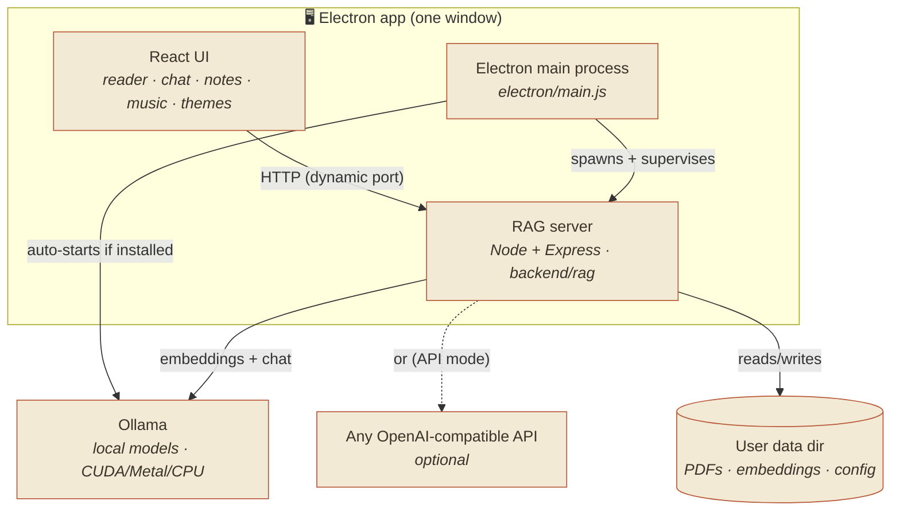
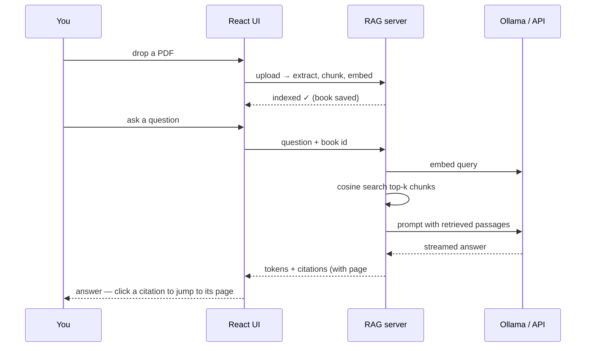

<div align="center">


# Lumen ✨

**A cozy, offline-first reading desk for your laptop.**
Drop in a PDF and read it in a warm lofi study space — with music, ambient
sounds, notes, a planner, a focus timer, and a **private AI that answers
questions about the book you're reading**. Everything runs on your machine.

<br/>

[](LICENSE)
[](../../releases)
[](https://www.electronjs.org/)
[](https://react.dev/)
[](MODELS.md)

### [⬇️ Download the latest release](../../releases/latest) · [🛠 Install guide](INSTALL.md) · [🤖 Model setup](MODELS.md)

<!-- Add docs/screenshots/hero.png (the main desk view) and it renders here: -->


</div>

---

## ✨ Why Lumen

A calm place to actually *read*, not another tab in your browser. It's a single
desktop app — no accounts, no cloud, no telemetry. Your PDFs, notes, and
conversations never leave your computer.

| | Feature | |
|---|---|---|
| 📖 | **Read any PDF** — smooth vertical scrolling, resizable, zoom, page memory |  |
| 💬 | **Chat with your book** — grounded answers with **clickable citations that jump to the source page**, fully local |  |
| 🎨 | **5 themes × light/dark** — Paper, Glassmorphism, Midnight, Sakura, Forest |  |
| 🖼️ | **Ambient wallpapers** you can switch between (or add your own) | |
| 🎵 | **Lofi player** + generated **rain / wind / waves** ambience | |
| 📝 | **Notes** (handwritten fonts, export to PDF) · ✅ **Planner** · ⏳ **Focus timer** |  |
| 🔒 | **Private by default** — offline, no accounts, nothing phones home | |

> _Screenshots live in [`docs/screenshots/`](docs/screenshots) — drop yours in and they appear above._

---

## ⬇️ Get Lumen

### Download (easiest)

Grab an installer from the [**Releases**](../../releases/latest) page. There are
**two editions** — pick one:

| Edition | Includes | Best for |
|---|---|---|
| **Full** — `Lumen-x.y.z-full-win-x64.exe` | All 8 lofi tracks + all 7 wallpapers | Just want everything |
| **Lite** — `Lumen-x.y.z-lite-win-x64.exe` | 2 tracks + 3 wallpapers (smaller download) | Smaller / slower connections |

Both are the **same app** with identical features — only the bundled music &
wallpapers differ. Lite users can add the rest anytime via the downloadable packs
on the same release:

- **`Lumen-music-pack.zip`** → the other 6 tracks
- **`Lumen-wallpaper-pack.zip`** → the other 4 wallpapers

Each zip has a short `HOW-TO-ADD.txt` — it's just Settings → *Sounds* → **Add
music**, or Settings → *Appearance* → **+** for wallpapers.

Install, launch, done. To chat with your books you'll also want a local model —
the **[install guide](INSTALL.md)** walks a non-technical friend through the
whole thing in ~5 minutes.

> Building from source? `npm run dist:full`, `npm run dist:lite`, or
> `npm run dist:all` (see [package.json](package.json)).

> ℹ️ The installer isn't code-signed, so Windows SmartScreen shows a
> "More info → Run anyway" prompt on first launch. That's expected for an
> open-source personal app.

### Run from source

You'll need **[Node.js 18+](https://nodejs.org)**.

```bash
git clone https://github.com/<your-username>/lumen.git
cd lumen

npm install
cd backend && npm install && cd ..

npm run electron:dev     # launches the whole thing (UI + reading assistant)
```

Build your own installer with `npm run dist` → output lands in `dist-electron/`.

---

## 🏛 Architecture

Lumen is a **React UI** wrapped in an **Electron shell** that supervises a small
**local RAG server** (Node + Express). The AI itself runs in **Ollama** (or any
OpenAI-compatible API you point it at). Nothing here talks to Lumen's servers —
there are none.



**How the pieces fit**

- **Electron shell** (`electron/main.js`) picks a free port, spawns the RAG
  server on it, auto-starts Ollama if it's installed, and injects the server URL
  into the renderer via `electron/preload.js`. It kills all children on exit —
  one window to open, one to close.
- **React UI** (`src/`) is a hand-built paper/lofi design system. Panels are
  draggable & resizable; the chat is a slide-out drawer you can dock left or
  right. All wallpapers/music are bundled and loaded relative to the app so they
  work under Electron's `file://`.
- **RAG server** (`backend/rag/`) does the retrieval-augmented generation:
  extracts PDF text **page-by-page**, chunks it, embeds each chunk, and stores a
  flat-file vector index. On a question it embeds the query, does cosine search,
  and streams an answer back with **citations that carry the source page** — so
  clicking a citation jumps the reader to exactly where the answer came from.
  Deep-dive: [`backend/rag/README.md`](backend/rag/README.md).
- **Models** run in **Ollama** locally (GPU-accelerated automatically — see
  [MODELS.md](MODELS.md)), or you can switch to a hosted API in the chat's ⚙
  settings.

### Data flow: asking a question



---

## 🧩 Tech stack

| Layer | Tech |
|---|---|
| UI | React 18 (CRA), custom CSS design system, `react-pdf` |
| Shell | Electron 31, electron-builder (NSIS / AppImage / deb) |
| Assistant | Node + Express, `pdf-parse`, flat-file cosine vector store, SSE streaming |
| Models | Ollama (local) or any OpenAI-compatible endpoint |

## 📁 Project structure

```
lumen/
├── electron/            # Electron main + preload (app shell, process supervision)
├── src/                 # React UI (components, hooks, styles, audio)
├── backend/rag/         # Local RAG server: chunker, vector store, providers, API
├── public/              # Bundled assets (wallpapers, lofi music, icons)
├── build-resources/     # App icon
├── docs/screenshots/    # README images
├── MODELS.md            # GPU, model install, shipping notes
├── INSTALL.md           # Friendly end-user setup guide
└── DESKTOP.md           # Desktop packaging details
```

## 🔒 Privacy & your data

Everything is stored locally in your OS user-data folder:

- **Windows:** `%APPDATA%\Lumen\rag-data\`
- **Linux:** `~/.config/Lumen/rag-data/`

Delete that folder to wipe everything. In API mode your key is stored locally and
never shown back to the UI.

## 🗺 Roadmap

- [ ] First-run onboarding that detects Ollama and offers to pull models
- [ ] Code-signed installers (remove the SmartScreen warning)
- [ ] macOS build + notarization
- [ ] Auto-update (`electron-updater`)

## 🤝 Contributing

Issues and PRs welcome — this is a personal project shared freely. Fork it, remix
it, make it yours.

## 📄 License

[MIT](LICENSE).

> **Asset note:** the bundled lofi tracks and wallpaper art are placeholders for
> the vibe — if you distribute your own build, swap in assets you have the rights
> to, or verify their licenses.
